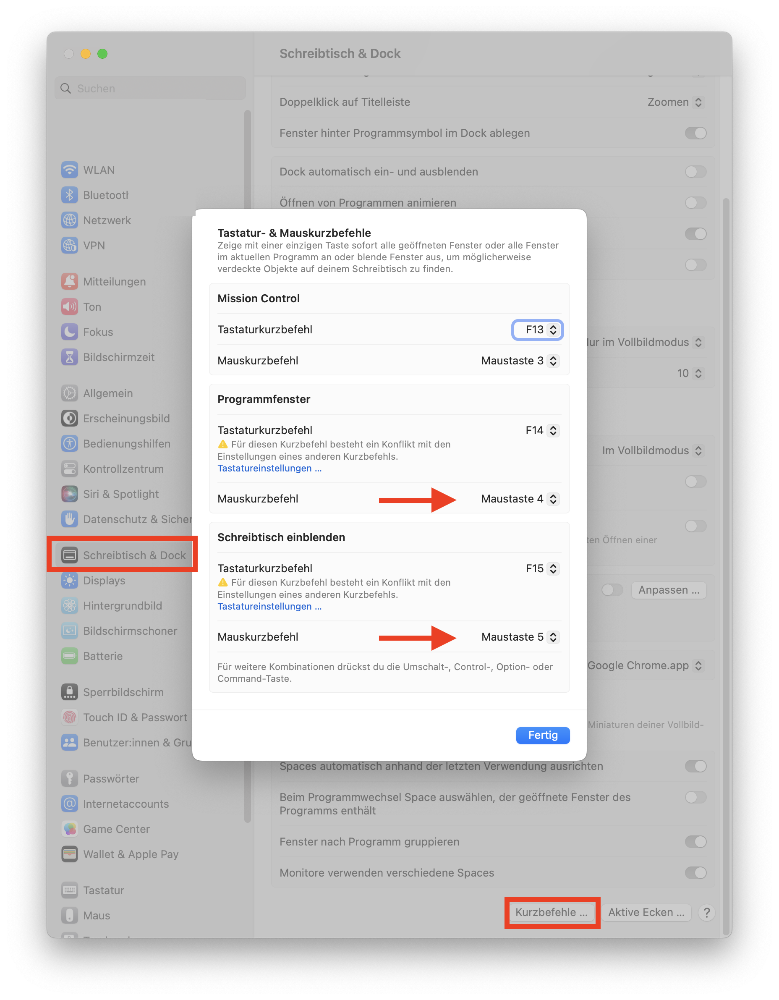

# macos-additional-mouse-keys
How to enable your additional mouse button-4 and button-5 on macos

Probably you have a similar problem like me: I use a Microsoft IntelliMouse which comes with 5 buttons. Very old but very reliable hardware. 
Nevertheless, newer macOS releases such as macOS Big Sur, Monterey or Ventura I always struggled to assign custom options to mouse button-3, button-4 and button-5 in default config. 
Several commercial solutions are available - and finally there is vanilla macOS solution also available for my preferred assignment:

System settings, Desktop & Dock, Shortcuts allows to assign the extra mouse buttons to mission control commands, as shown in this screenshot:

If you want more complex assignment of the buttons, there is an awesome macOS app https://github.com/pqrs-org/Karabiner-Elements which allows Keyboard but also Mouse reassignment beyond any known level.
Here is how the same settings could be achieved with Karabiner-Elements: 

After following the installation documentation, I tried to add my default assignment to button-4 which is "Mission Control: Application Windows" and button-5 which is "Mission Control: Show Desktop". It turned out, it's not that easy but doable!

Karabiner-Elements knows so called "Complex Modifications". They are really complex in the sense that they can do awesome stuff. So Karabiner-Elements is able to load them from the Internet.
Nevertheless, none of the complex modifications covered my requirements, so I wrote my own, which you find in file [mouse4_5_applicationwindows_desktop.json](mouse4_5_applicationwindows_desktop.json).

This file needs to be imported into Karabiner-Elements. Simply open a macOS terminal shell and copy paste the following into it:

    open "karabiner://karabiner/assets/complex_modifications/import?url=https://raw.githubusercontent.com/mskopp/macos-additional-mouse-keys/main/mouse4_5_applicationwindows_desktop.json"

You want to modify your own complex rule and test it without setting up a GitHub repo for it? Thats easy. Just create your Karabiner-Elements JSON file and type the following into a macOS terminal and adopt the path to your file to import it:

    open "karabiner://karabiner/assets/complex_modifications/import?url=file:///Users/yourname/yourAweSomeComplexRUle.json"

Yes.. this is not the ultra-user-friendly click-to-configure solution but it works.
